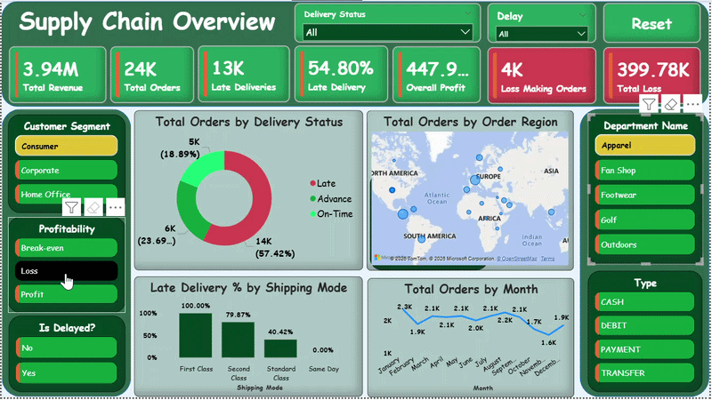
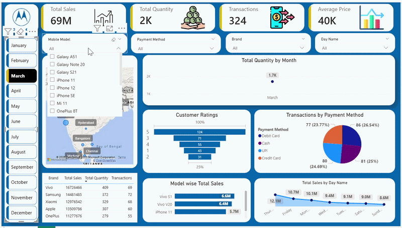
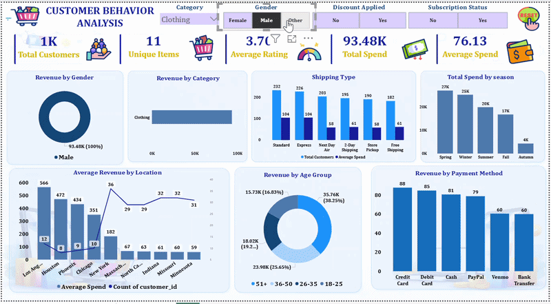
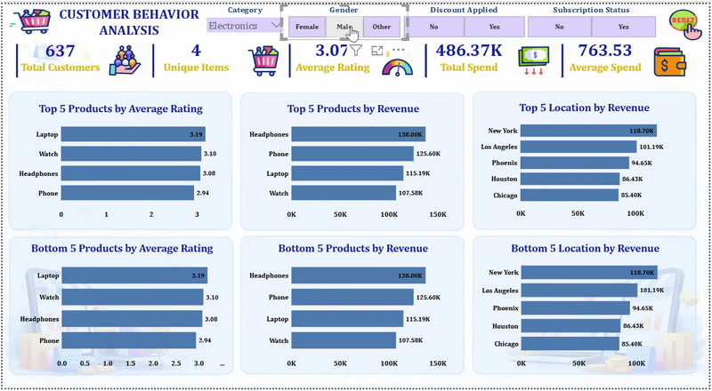

<h1 align="center">👋 Hi, I'm Kuldeep Jha</h1>

<h3 align="center">Data Analyst · AI-Assisted Analytics · Business Intelligence</h3>

  
  
  
  

---

## 💡 About Me

I turn raw, messy data into clear business decisions. With **4 years of hands-on data management experience in a government healthcare institution** and a strong self-driven transition into analytics, I bring a rare combination of real-world operational exposure and modern technical skills.

- 🔍 Specialized in **EDA, data cleaning, dashboard development, and business analytics**
- 📊 Built end-to-end projects across supply chain, retail sales, customer behavior, and inventory domains
- 🤖 Familiar with **Machine Learning fundamentals** and actively working with **AI-assisted analytics workflows**
- 🎯 Goal: Leverage data to generate actionable insights that directly impact business outcomes

---

## 🛠️ Skills

| Category | Tools & Technologies |
|---|---|
| **Languages** | Python, SQL |
| **Libraries** | Pandas, NumPy, Matplotlib, Seaborn, Scikit-Learn |
| **BI & Visualization** | Power BI, Excel, Jupyter Notebook |
| **Databases** | MySQL, MySQL Workbench |
| **Concepts** | EDA, Data Cleaning, Business Analytics, Data Visualization, Machine Learning, Predictive Analytics |
| **Other** | Prompt Engineering, AI-Assisted Analytics |

---

## 📈 Featured Projects

### 🚚 Supply Chain Analysis
> **Tech Stack:** Python · Pandas · SQL · Power BI · Machine Learning · Scikit-Learn

Analyzed **172,765+ supply chain transactions** to uncover delivery inefficiencies, revenue exposure, operational bottlenecks, and delay prediction opportunities.

| Key Finding | Business Impact |
|---|---|
| **54.71% late delivery rate** identified | Highlighted major operational inefficiencies affecting customer satisfaction |
| **$19.25M revenue exposed to delay risk** | Revealed significant financial exposure from delayed shipments |
| **100% delay rate in First Class shipping** | Identified a critical logistics failure risking **$5.41M revenue** |
| Built a **Tuned Random Forest ML model** with **77% f1-score** | Enabled proactive late-delivery prediction before shipment |
| ML-driven intervention strategy proposed | Potential to prevent **10% delays (~$1.93M revenue protected annually)** |
| Regional bottleneck detection performed | Identified Central Africa & Southeast Asia as high-risk logistics zones |

### 🔍 Machine Learning Implementation
- Trained and evaluated multiple ML models:
  - Logistic Regression
  - Decision Tree
  - AdaBoost
  - Gradient Boosting
  - Random Forest
  - Tuned Random Forest
- Best model achieved:
  - **74% Accuracy**
  - **77% F1 Score**
- Predicted late delivery risk using:
  - Shipping Mode
  - Scheduled Shipment Days
  - Category
  - Customer Segment
  - Department
  - Region
  - Order Month
  - Order Hour

---

### 📱 Mobile Sales Dashboard
> **Tech Stack:** Power BI

Built an interactive Power BI dashboard to analyze mobile sales across brands, regions, and customer segments.

| Key Finding | Business Impact |
|---|---|
| Top products identified | Contribute to **~35% of total sales revenue** |
| Regional performance gaps surfaced | Can improve regional sales by **10–15%** via targeted marketing |

---

### 🛒 Customer Behavior Analysis
> **Tech Stack:** Python · SQL · Power BI

Performed customer segmentation and purchase pattern analysis to support retention and marketing strategies.

| Key Finding | Business Impact |
|---|---|
| Repeat customers drive **60%+ of recurring purchases** | Highlights value of retention-focused strategies |
| Segmentation insights generated | Can improve marketing conversion rates by **12–18%** |

---

### 🏪 Zepto Inventory Analysis
> **Tech Stack:** Python · SQL

Conducted stock-level and inventory analysis to identify out-of-stock patterns and category-wise performance gaps.

| Key Finding | Business Impact |
|---|---|
| Out-of-stock rate **>25%** in key categories | Indicates significant revenue leakage |
| Stock shortage reduction potential | **~15%** improvement in product availability |

---

## 💼 Work Experience

**Government Ayurvedic College & Hospital, Bhagalpur**  
*Data Entry Operator (Outsourced via BELTRON) · 4 Years*

- Worked as an outsourced contractual Data Entry Operator deployed through **Bihar State Electronics Development Corporation Ltd. (BELTRON)** at a government healthcare institution
- Managed and maintained large-scale government datasets while ensuring accuracy, consistency, confidentiality, and record integrity
- Handled administrative records, digital documentation, data entry operations, and reporting workflows in a fast-paced government office environment
- Developed strong foundational skills in data handling, attention to detail, operational processes, and workflow management
- Self-transitioned into Data Analytics by independently building end-to-end projects using **Python, SQL, Power BI, and Machine Learning**
- Applied practical business and operational understanding from real-world government processes to generate actionable insights in analytics projects

---

## 🎓 Education & Certifications

**Bachelor of Arts – Economics (Honours)**  
Indira Gandhi National Open University (IGNOU), Delhi

| Certification | Issuer | Year |
|---|---|---|
| [Data Analytics Course Certificate](https://pwskills.com/learn/certificate/edb74b64-ce5a-48db-9c50-339219302b0d/?isCareerPath=true) | PW Skills | Apr 2026 |
| [AI Tools Workshop Certificate](https://certx.in/certificate/0270772f-3809-4400-b29b-1e1c61cd09971313377) | Be10x | May 2026 |

---

## 📬 Let's Connect

I'm actively looking for **Data Analyst / Business Analyst** roles. If you're working on interesting data problems or have an opportunity to discuss, I'd love to connect!

  <a href="mailto:kuldeep.786jha@gmail.com">📧 kuldeep.786jha@gmail.com</a> &nbsp;|&nbsp;
  <a href="https://linkedin.com/in/kuldeep-jha-b3517b316">🔗 LinkedIn</a> &nbsp;|&nbsp;
  <a href="https://jha-kuldeep.github.io">🌐 Portfolio</a> &nbsp;|&nbsp;
  <a href="https://github.com/jha-kuldeep">💻 GitHub</a>

---

<i>"Transforming data into decisions — one insight at a time."</i>

